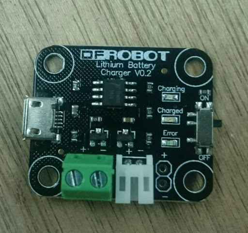
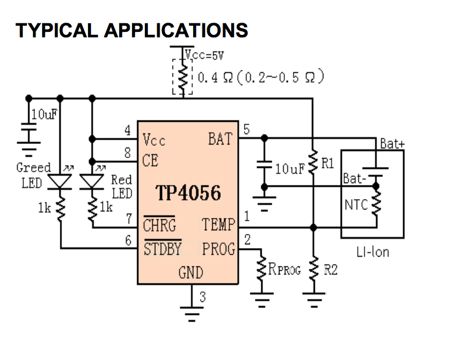
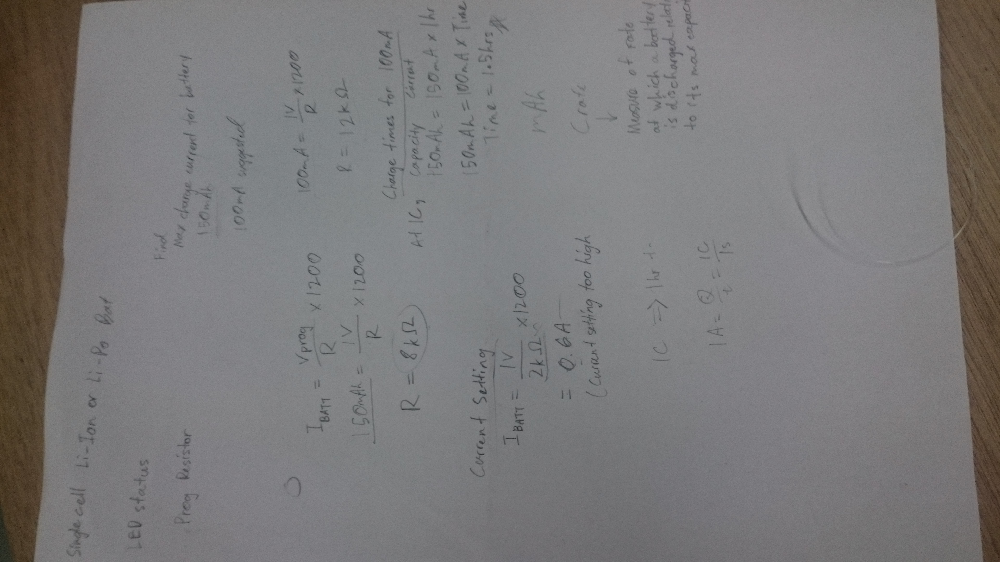
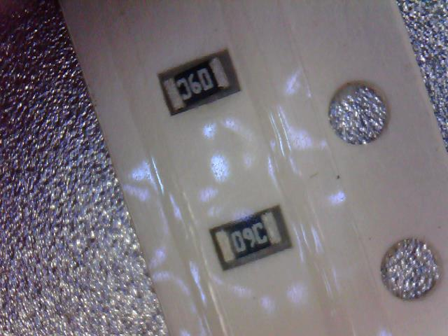
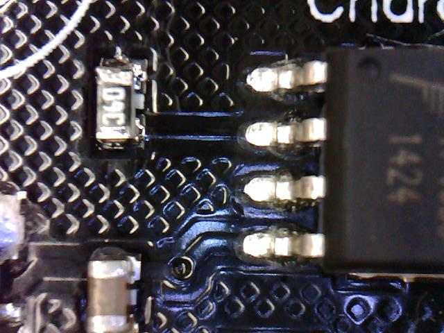

## Objectives

1. Charger Components
2. Tasks
3. Issues

---.class #id

## Charger Components

* Module: Lithium Battery Charge V0.2

---.class #id

## Charger Components

* Lithium Ion (7V 150mAH)

[Click here for Schema of the chip](http://www.dfrobot.com/image/data/DFR0208/Lithium%20Battery%20%20charger%20SCH.pdf)

--- .class #id

## Schematics

--- .class #id

## Initial Tasks

Check:

1. if charing settings of the **charge controller IC**   are comparable with Lithium Ion Battery's settings wrt. current and capacity.

--- .class #id 

## Difference

1. Off the shelf charger was **NOT** suitable for charging the lithium battery.
2. Based of calculation provided in the dataseet, the charger will charge at 0.6A whereas the battery is rated at charging current of 150mAh (**much higher!**)

--- .class #id 

## Formula for calculating dataset

--- .class #id 

## Formula for calculating dataset

I(Bat) = V(Prog) * 1200 / R(Prog)

Keeping the current constant, we figure out the 

| Symbol      | Description     | Value           |
| ----        | ---             | ---             |
| **I**(Bat)  | BAT Pin Current | 150mAh or 100mAh |
| **V**(Prog) | Voltage         | 1V              |
| R(Prog)     | Resistance      | 8 or 12 kOhm       |

--- .class #id

## Removing the resistor

### Step1: Desoldering
* Temperature 380 degrees Celcius
* Air Volume 3.5Pa

--- .class #id

## Demo: Removing the existing resistor

NOTE:: Rmbr to clean up using the desoldering wick

1. dip the wick in the flux (which is a weak acid; which will remove the oxided parts)
2. cover the soldering lumps with the wick and apply the soldering gun
3. Rub
4. flux cleaner (spray) on cotton buds and clean the board

---.class #id

## Demo: Removing the existing resistor

Remember to remove the solder from before (image below before removing solder)

---.class #id

## Demo: Putting in the new resistor

Soldering gun temp: 330 degrees celcius

---.class #id

## Demo: Putting in the new resistor

* Find the resistor, check if ID corresponds to the desired ohms using android app [Electrodroid](https://play.google.com/store/apps/details?id=it.android.demi.elettronica&hl=en) (reliable according to Joo Khai)

---.class #id

## Demo: Surface Mount Devices (SMD) Soldering

1. use board-vice, 
2. add solder on one pad first
3. rest your wrist on the table if you have shaky hands
4. melt solder on pad using a pair of tweezers grab component while the solder is still liquidified then slide it in.
5. complete the soldering on the other side

---.class #id
## Demo: Surface Mount Devices (SMD) Soldering

The finished product

---.class #id

## Demo: Verifying if the solderin worked

* verify if the soldering has been accurate:
    use a multimeter. place the electrodes on ground and pin2 (where our resistor is connected to) using the ?signal? mode

---.class #id

## The End
